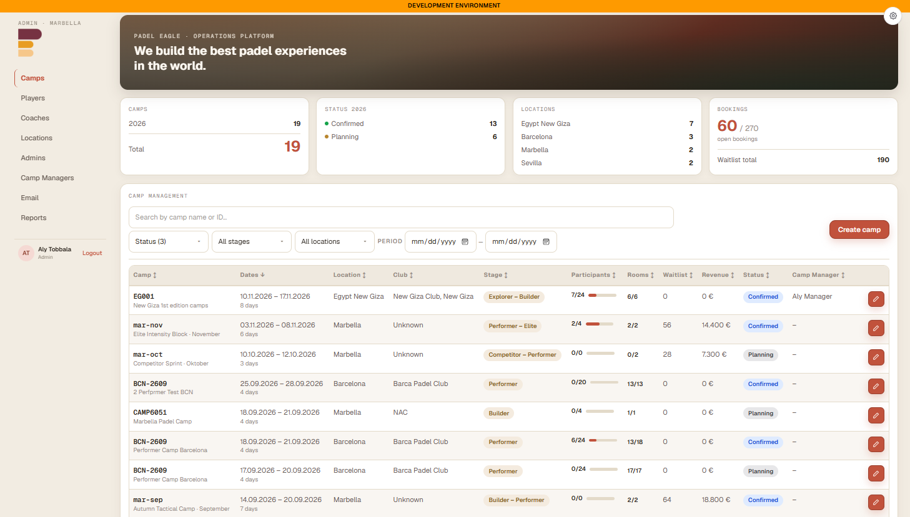
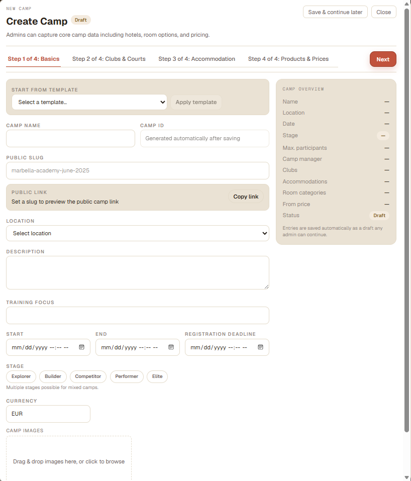
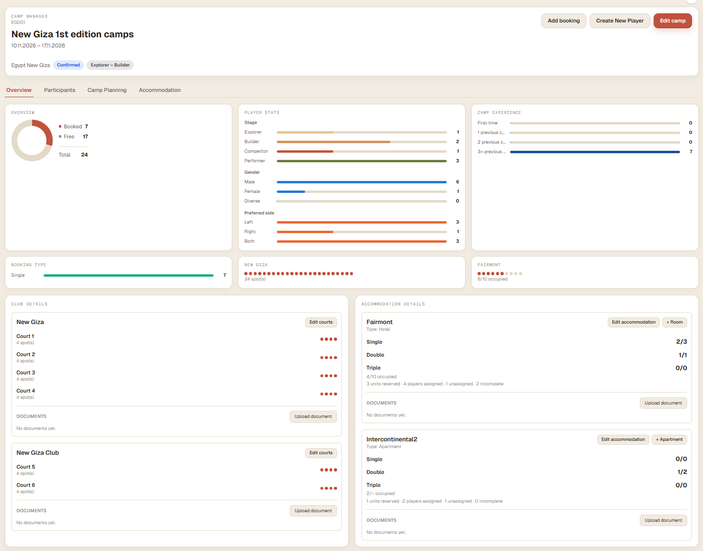

# Camp Management Platform

A full-stack web platform that lets a sports-camp operator plan camps, manage accommodation and training sessions, and handle player bookings, while players get their own portal to register, book and follow their camp journey. Built for a sports-camp business.

> **Private source.** The code is not public. See the [Note](#note) at the bottom.

## Screenshots

Screenshots of the running application, using test data only.

**Admin dashboard: camp list with filters, KPIs and status tracking**



**Camp creation: multi-step wizard with draft saving, templates and live summary**



**Camp detail: occupancy, player statistics, courts and accommodation at a glance**



## Tech Stack

| Layer | Technology |
|---|---|
| Languages | TypeScript, SQL |
| Frontend | Next.js 16 (App Router), React 19, Tailwind CSS 4 |
| Internationalization | i18next / react-i18next (English and German) |
| Backend | Node.js 22, Express 4 |
| Validation | Zod |
| Database | PostgreSQL, Prisma 6 ORM with versioned migrations |
| Auth | Supabase Auth, JWT verification with `jose` (JWKS) |
| File storage | Supabase Storage |
| Email | Brevo transactional email API |
| Testing | Node's built-in test runner via `tsx` |
| CI/CD | GitHub Actions (lint, build, secret scanning with Gitleaks) |
| Tooling | npm workspaces monorepo, ESLint, Railway hosting |

## Architecture

```
  Browser
     |
     v
+--------------------+      +--------------------+
| Admin / coach app  |      | Player-facing app  |
| Next.js (SSR)      |      | Next.js (SSR)      |
+---------+----------+      +----------+---------+
          |   bearer token             |
          +-------------+--------------+
                        v
               +-----------------+       +----------------+
               |  REST API       |------>| Email service  |
               |  Express + Zod  |       +----------------+
               +--------+--------+
                        |            +--------------------+
                        +----------->| Auth + file storage|
                        |            +--------------------+
                        v
               +-----------------+
               |  PostgreSQL     |
               |  (Prisma)       |
               +-----------------+
```

- **Frontend:** two Next.js apps, one for staff (admin and coach portals) and one for players. Server-rendered pages, server-side session handling, and a bilingual UI.
- **Backend:** a single Express REST API that owns all business logic and is the only component that talks to the database. Requests are validated with Zod schemas.
- **Database:** PostgreSQL managed through Prisma, with a migration history kept in one codebase to avoid schema drift.
- **Auth:** managed identity provider. The API verifies signed tokens locally against a public key set and applies role-based access control.
- **Integrations:** transactional email and object storage for images and documents.
- **Deployment:** each app is deployed as a separate service. CI runs lint, build and a secret scan on every push and pull request.

## What I Built

This was a **solo project**: I was the only developer, and I designed and implemented every layer for a client.

- Designed the relational data model and wrote the migration history, growing it to dozens of entities over roughly two months.
- Built a REST API of well over 100 endpoints with schema validation, role-based authorization and audit fields.
- Built the admin and coach portals: camp creation and editing, drafts, session planning board, accommodation timeline, participant management and player profiles.
- Built the player-facing app: registration, camp browsing, a booking wizard and account management.
- Implemented email notifications with settings editable at runtime instead of through redeploys.
- Added English and German localization across both frontends.
- Wrote unit tests for domain logic and set up CI with lint, build and secret scanning.

## Technical Challenges

**1. Fast authentication without a network hop per request.**
A single page load fires several authenticated API calls, and verifying each one against the identity provider made login feel slow. I switched to verifying tokens locally against the provider's public keys (JWKS). Latency dropped, and key rotation now works without redeploying.

**2. Keeping one database schema consistent across two codebases.**
The staff app and the player app share one database. Two independent migration histories would eventually drift, so I made the API the only component with database access. The player app reads and writes exclusively through it. New needs become new API endpoints first.

**3. Side effects that must never break the main operation.**
Confirming a booking or creating an account also sends email. I made the email layer fail-safe, so a missing configuration or a provider outage is logged and skipped instead of failing the request. Its settings live in the database, so they can change without a deployment.

## Note

The source code of this project is private. I'm happy to give a **live code walkthrough** and discuss the design decisions in an interview.

- Email: [alytobbala@gmail.com](mailto:alytobbala@gmail.com)
- LinkedIn: [linkedin.com/in/alytobbala](https://www.linkedin.com/in/alytobbala/)

Licensed for viewing only, see [LICENSE](LICENSE).
